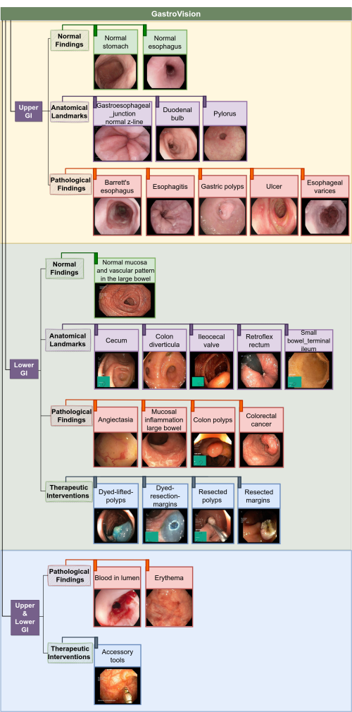
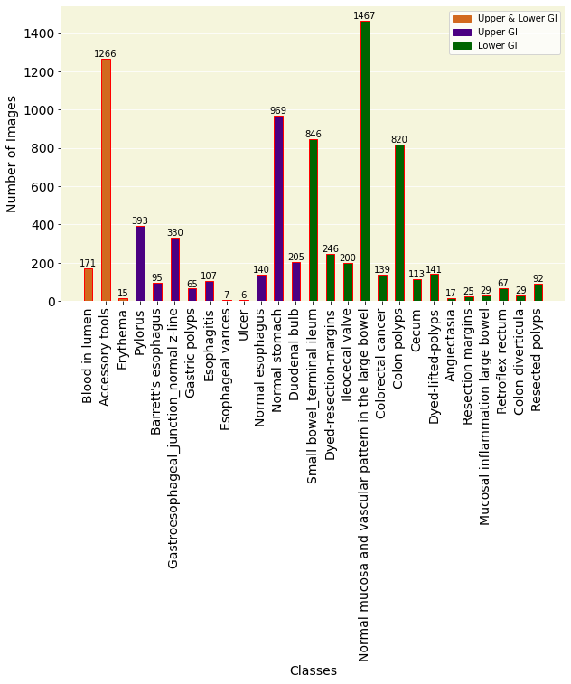
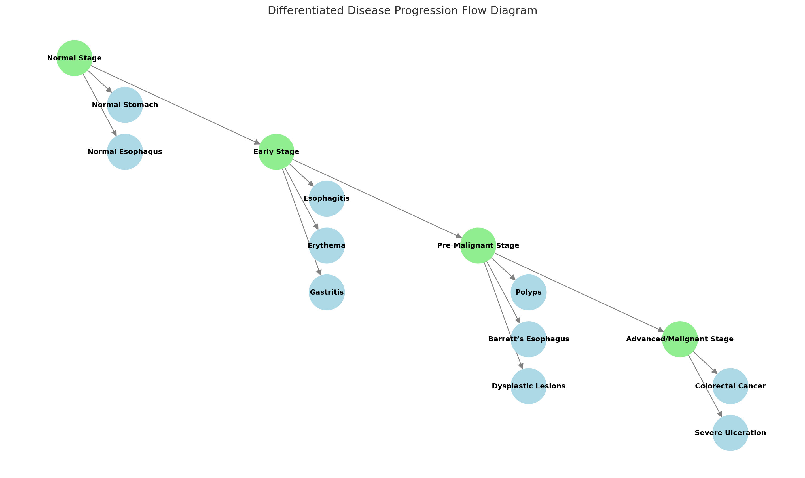
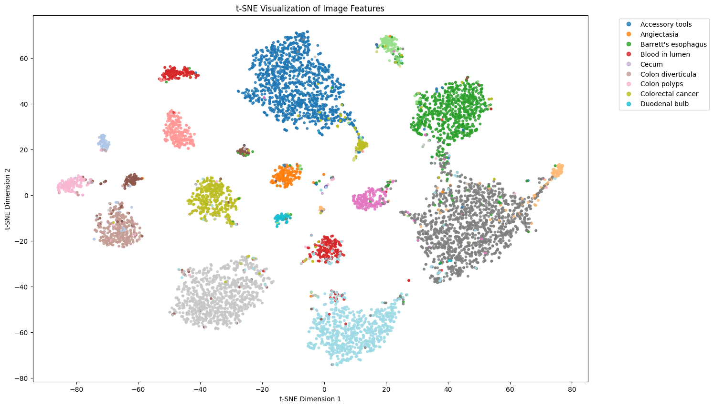
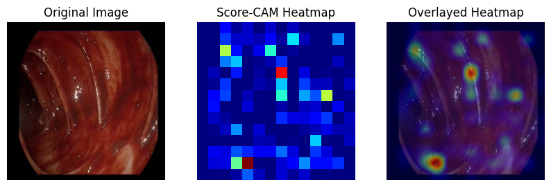
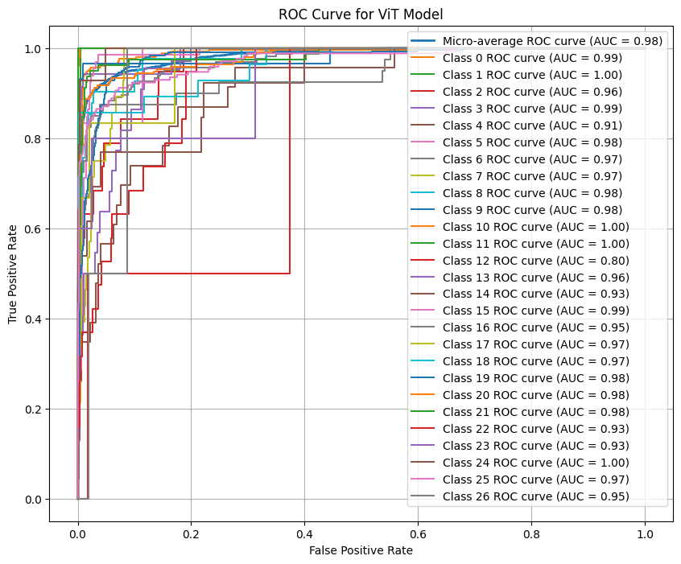

# GastroEndo-Seq
GastroEndo-Seq: Predictive Sequential Model for GI Disease Progression and Outcome Forecasting

---

## **Table of Contents**
1. [Abstract](#abstract)
2. [Introduction](#introduction)
3. [Dataset](#dataset)
4. [Class-to-Stage Mapping](#class-to-stage-mapping)
5. [Simulated Progression Stages](#simulated-progression-stages)
6. [Methods](#methods)
   - [Model Development](#model-development)
   - [Heatmap Visualization](#heatmap-visualization)
7. [Results](#results)
8. [Discussion](#discussion)
9. [Conclusion](#conclusion)
10. [Potential Impact and Long-Term Vision](#potential-impact-and-long-term-vision)
11. [License](#license)

---

## **Abstract**
Gastrointestinal disorders pose a significant burden on healthcare systems given their prevalence and potential for malignancy and serious complications. Early detection and accurate prediction of disease stage are essential to improve outcomes and reduce morbidity, mortality, and associated healthcare costs. Current diagnostic approaches rely heavily on physician’s knowledge, experience, and judgment without many objective tools available for forecasting disease trajectories. GastroEndo-Seq addresses this gap by utilizing artificial intelligence techniques and sequential endoscopic imaging to predict GI disease stage and simulate clinical trajectories. This predictive model leverages Vision Transformers (ViT) and Few-Shot Learning to analyze disease progression over time, offering heatmap visualizations for clinical transparency. The model achieved significant accuracy and AUC-ROC performance across 27 GI classes, demonstrating its potential to enhance early diagnosis, optimize patient care, and reduce unnecessary interventions. This study evaluates the effectiveness of GastroEndo-Seq in classifying and interpreting GI disease stage using the multi-center GastroVision dataset, with the aim of improving diagnostic precision, enabling personalized treatment, and reducing healthcare costs.

---

## **Introduction**
Early diagnosis and treatment are critical in managing GI diseases, especially conditions with malignancy potential (e.g., colorectal polyps, inflammatory bowel disease). GastroEndo-Seq addresses this challenge by forecasting disease trajectories using sequential endoscopic data. The innovative features include:

- **Disease progression heatmaps** for visualizing hotspots of disease activity.
- **Few-Shot Learning** for personalized predictions in low-data scenarios.
- Categorization of disease progression into **four clinical stages** to simulate disease trajectories.

---

## **Dataset**
- **Name:** [GastroVision Dataset](https://osf.io/84e7f/)
- We used GastroVision, a multi-center open-access gastrointestinal (GI) endoscopy dataset that includes images from various anatomical landmarks, pathological abnormalities, polyp removal cases, and normal findings. The dataset was collected from Baerum Hospital in Norway and Karolinska University in Sweden. Key highlights include:
- **Total Images:** 8,000
- **Classes:** 27 different GI conditions
- **Annotation:** Verified and annotated by experienced GI endoscopists
- **Categories:**
  - Anatomical landmarks
  - Pathological abnormalities
  - Polyp removal cases
  - Normal findings from the GI tract

### Dataset Representation

### Visual Representation of Class Distribution

---

## **Class-to-Stage Mapping**
The dataset was categorized into four clinically relevant disease progression stages:

1. **Normal Stage**: Healthy mucosa
   - Normal stomach
   - Normal esophagus
2. **Early Stage**: Inflammatory changes and early non-malignant abnormalities
   - Esophagitis
   - Erythema
   - Gastritis
3. **Pre-Malignant Stage**: Conditions with potential malignancy
   - Polyps
   - Barrett’s esophagus
   - Dysplastic lesions
4. **Advanced/Malignant Stage**: High-risk or malignant abnormalities
   - Colorectal cancer
   - Advanced mucosal invasion
   - Severe ulceration

### Progression of Stages

---

## **Simulated Progression Stages**
Progression stages were simulated using embeddings derived from the Vision Transformer (ViT) model. Sequential embeddings from endoscopic images predicted transitions across the four stages:

- **Normal Stage**: No significant visual abnormalities.
- **Early Stage**: Inflammation or erosion detected.
- **Pre-Malignant Stage**: Abnormal growths or dysplastic changes.
- **Advanced/Malignant Stage**: Evidence of invasive malignancy.

### t-SNE Visualization of Image Features

---

## **Methods**

### **Model Development**
1. **Vision Transformer (ViT)**
   -	Divides images into patches and uses attention mechanisms to capture spatial and contextual features.
   -	Achieved **80%** accuracy and AUC-ROC of **0.98**, outperforming traditional CNNs.
   -	Particularly effective for progression-based analysis due to its ability to model global dependencies.

2. **DenseNet-121**
   -	Dense connectivity for feature reuse.
   - Performance: **36.77%** accuracy.

3. **ResNet-50**
     -	Pretrained CNN model with skip connections for deeper feature extraction.
     -	Performance: **32.42%** accuracy.

4. **Custom CNN**
   - Lightweight architecture with convolutional and fully connected layers.
   - Performance: **56%** accuracy, demonstrating limitations with complex datasets.

5. **Few-Shot Learning**
   - Employed to address low-data scenarios for rare disease classes.
   - Used Prototypical Networks to generate class prototypes from embeddings.
   -	Achieved **81%** accuracy for few-shot learning tasks.

## Model Accuracies

| Model             | Accuracy (%) |
|--------------------|--------------|
| Vision Transformer | 80          |
| Few-Shot Learning  | 81          |
| DenseNet-121       | 36.77       |
| ResNet-50          | 32.42       |
| Custom CNN         | 56          |

### Heatmap Visualization
To enhance interpretability, **Score-CAM** (Class Activation Mapping) was used:
- Highlights regions contributing most to predictions.
- Enables clinicians to visualize disease hotspots for progression analysis.

Example of Heatmap Visualization:

---

## **Results**

### **Performance Metrics**
- **Vision Transformer (ViT):**
  - Accuracy: **80%**
  - AUC-ROC: **0.98**

- **Few-Shot Learning:**
  - Accuracy: **81%**

### ROC Curve
- ROC curves for all 27 classes indicated AUC values between 0.80 and 1.00.
- High AUC values reflect the model's ability to distinguish between true positives and false positives effectively.

---

### Key Findings:
1. **Vision Transformer Superiority**:
   - The ViT model consistently outperformed other architectures, capturing global dependencies essential for sequential disease progression analysis.
2. **Few-Shot Learning**:
   - Enabled the model to generalize to rare conditions with minimal training data, a crucial feature for clinical applications
3. **Heatmaps for Clinical Transparency**:
   - Score-CAM visualizations provided actionable insights into disease progression, supporting diagnostic decision-making.

---

## **Conclusion**
GastroEndo-Seq represents a robust framework for predicting GI disease progression using sequential endoscopic images. By integrating Vision Transformers, Few-Shot Learning, and interpretability features, the model offers a comprehensive solution for early diagnosis and personalized care.

---
## **Potential Impact and Long-Term Vision**

1. **Early Detection of High-Risk GI Conditions**
   - Forecasting disease progression enables early interventions, significantly reducing morbidity and mortality.
   - Increased survival rates through proactive care by identifying early markers of malignancy or inflammation.
   - Reduced unnecessary interventions through accurate differentiation of benign and malignant cases, minimizing patient risk and healthcare costs.

2. **Contribution to Predictive GI Research and Education**
   - The accumulated predictions and outcomes form a dynamic research database for further AI advancements and medical training.
   - Expanded knowledge of disease pathways, offering insights into factors influencing outcomes.
   - Educational tools for clinicians to simulate disease progression and refine diagnostic skills.
---

## **License**
  
This work is licensed under the [Creative Commons Attribution 4.0 International License](https://creativecommons.org/licenses/by/4.0/).
